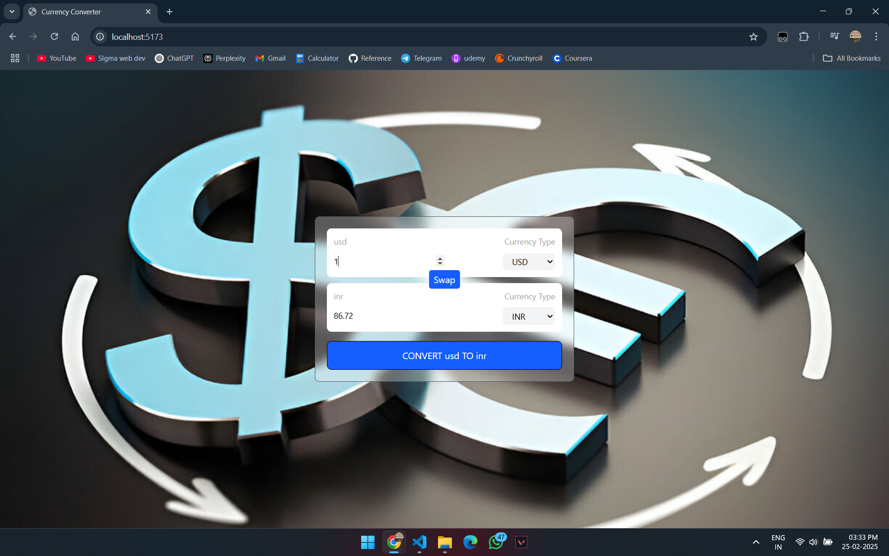

# Currency Converter - [LIVE](https://currency-converter-sandy-theta.vercel.app/)

A simple real-time currency converter built with React, utilizing an external API for fetching exchange rates.

## Live Demo
[Click here to view the live project](https://currency-converter-sandy-theta.vercel.app/)

## Screenshot



## Features

- Real-time currency conversion between various currencies
- User-friendly interface with intuitive design
- Responsive layout for seamless use on different devices

## Technologies Used

- **React**: JavaScript library for building user interfaces
- **Vite**: Next-generation frontend tooling
- **Tailwind CSS**: Utility-first CSS framework for styling

## Installation

1. **Clone the repository**:
   ```bash
   git clone https://github.com/TheRealFarhanDev/Currency-Converter.git
   cd Currency-Converter
   ```

2. **Install dependencies**:
   ```bash
   npm install
   ```

3. **Start the development server**:
   ```bash
   npm run dev
   ```
   Open your browser and navigate to `http://localhost:5173/` to view the application.

## Usage

- Enter the amount you wish to convert.
- Select the source currency and the target currency from the dropdown menus.
- The converted amount will be displayed in real-time as you input values.

## Project Structure

```
Currency-Converter/
├── public/
│   └── vite.svg
├── src/
│   ├── assets/
│   │   └── react.svg
│   ├── components/
│   │   ├── CurrencyConverter.jsx
│   │   └── Header.jsx
│   ├── App.css
│   ├── App.jsx
│   ├── index.css
│   ├── main.jsx
│   └── vite-env.d.ts
├── .gitignore
├── index.html
├── package.json
├── README.md
├── vite.config.js
└── CurrencyConverter.png
```

The `src/components/` directory contains the main components of the application:

- `CurrencyConverter.jsx`: Handles the logic and UI for currency conversion.
- `Header.jsx`: Displays the header section of the application.

## API Integration

This project fetches real-time exchange rates from an external API. Ensure you have a stable internet connection for the application to function correctly.


